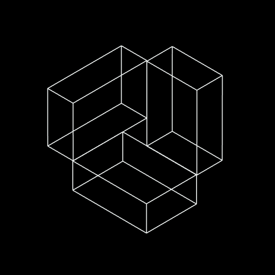

  

  
  
  

 

  

<table align="center">
  <tr>
    <td width="58%" valign="top">
      <h3>Engineering Profile</h3>
      

        Senior Software Engineer focused on frontend architecture, platform engineering,
        full-stack systems, Android, and fintech infrastructure. I build scalable
        React and TypeScript applications, Kotlin-based Android flows, secure backend
        integrations, and production systems with CI/CD, Docker, Linux, observability,
        testing, and strong technical ownership.
      

      

        Current work includes React 19 monorepos, shared UI libraries, multilingual
        public and admin platforms, private package delivery, fintech interfaces,
        infrastructure hardening, zero-downtime releases, and developer experience.
      

      

        
      

    </td>
    <td width="42%" valign="top" align="center">
      
    </td>
  </tr>
</table>

 

<h2 align="center">Technology Stack</h2>

  
   
  <h3>Frontend Foundation</h3>
  
  
  
  
   
  
  
   
  
  
  
  
  

 

<table align="center">
  <tr>
    <td align="center" valign="top" width="50%">
      <h3>Architecture &amp; UI</h3>
      
      
      
      
      
      
      
      
      
      
      
    </td>
    <td align="center" valign="top" width="50%">
      <h3>Backend &amp; APIs</h3>
      
      
      
      
      
      
      
      
      
      
      
    </td>
  </tr>
  <tr>
    <td align="center" valign="top" width="50%">
      <h3>Platform &amp; Delivery</h3>
      
      
      
      
      
      
      
      
      
      
      
      
      
      
      
      
      
      
    </td>
    <td align="center" valign="top" width="50%">
      <h3>Quality &amp; Observability</h3>
      
      
      
      
      
      
      
      
      
      
      
      
      
      
    </td>
  </tr>
</table>

<h2 align="center">Current Focus</h2>

<table align="center">
  <tr>
    <td valign="top" width="33%">
      <h3>Frontend Architecture</h3>
      

        
      

      

        React 19 modernization, shared UI foundations, routing patterns,
        localization systems, testing standards, and maintainable monorepo structure.
      

    </td>
    <td valign="top" width="33%">
      <h3>Platform Engineering</h3>
      

        
      

      

        Dockerized environments, GitLab CI/CD, private package registries,
        Nginx and Traefik routing, release reliability, and production resilience.
      

    </td>
    <td valign="top" width="33%">
      <h3>Secure Product Delivery</h3>
      

        
      

      

        REST integrations, authentication flows, signer-style cryptographic workflows,
        observability, security hardening, backup strategy, and zero-downtime delivery.
      

    </td>
  </tr>
</table>

<h2 align="center">Selected Experience</h2>

<table align="center">
  <tr>
    <td valign="top" width="50%">
      

        
         
        
      

      

        Senior Frontend Architect &amp; DevOps Engineer leading React 19 monorepo
        architecture, shared UI library delivery, multilingual public/admin platforms,
        GitLab CI/CD, and private npm registry workflows.
      

    </td>
    <td valign="top" width="50%">
      

        
         
        
      

      

        Platform Engineer, Senior Frontend Architect, and Android Engineer working
        across fintech frontend modernization, Docker infrastructure, CI/CD,
        Kotlin + Jetpack Compose, observability, and reliable production releases.
      

    </td>
  </tr>
  <tr>
    <td valign="top" width="50%">
      

        
         
        
      

      

        CTO experience defining technical strategy for fintech infrastructure,
        Linux production environments, PostgreSQL, Nginx, monitoring, SIEM,
        backup and disaster recovery, and vulnerability management.
      

    </td>
    <td valign="top" width="50%">
      

        
         
        
      

      

        Frontend and backend educator with more than 18 cohorts taught through
        project-based JavaScript, React, Node.js, architecture, debugging, and
        production-oriented development workflows.
      

    </td>
  </tr>
  <tr>
    <td valign="top" width="50%">
      

        
         
        
      

      

        Frontend and full-stack work across a production corporate website,
        responsive Next.js UI, SEO metadata, reusable content modules, and a
        multilingual scheduling system with role-based customer, worker, and admin flows.
      

    </td>
    <td valign="top" width="50%">
      

        
         
        
      

      

        Full-stack workforce and payroll operations platform using React, Node.js,
        Express, MongoDB, JWT authentication, external ASMIS API integrations,
        editable grouped tables, multilingual UI, and internal reporting workflows.
      

    </td>
  </tr>
  <tr>
    <td valign="top" colspan="2">
      

        
      

      

        Master's degree in automation of production processes, Full-Stack Web
        Developer certification, Front-End Web Developer certification, and practical
        course authoring experience.
      

    </td>
  </tr>
</table>

<h2 align="center">Build Principles</h2>

  
   
  
  
  
  
  

 

  

